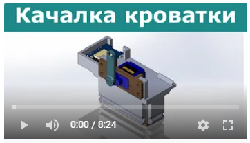

# Автоматическая качалка для кроватки ребенка

## Видео

## Как прошить

Загрузите и установите Arduino ESP8266 filesystem uploader plugin, следуя инструкциям на этой странице: https://github.com/esp8266/arduino-esp8266fs-plugin

Перед загрузкой прошивки через Arduino IDE сначала выполните команду Select Tools > ESP8266 Sketch Data Upload

Переименуйте config.example в config.ino

Потом можно прошивать как обычно
